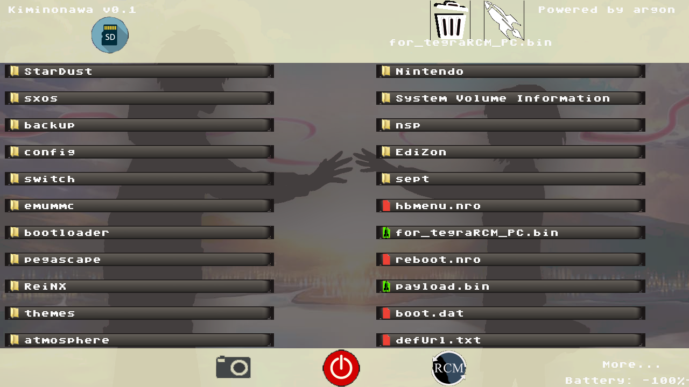

# Kiminonawa

**Kiminonawa is a payload whose objective is to be a file manager, of the micro sd before the start of HORIZON**
## features

* Delete Files

* launch payloads

## future improvements

* rename files

* copy and move files

* txt read

## Credits

fork [Argon](https://github.com/Guillem96/argon-nx)

* __devkitPro__ for the [devkitA64](https://devkitpro.org/) toolchain.
* __naehrwert__ and __st4rk__ for the original [hekate](https://github.com/nwert/hekate) project and its hwinit code base.
* __CTCaer__ for the continued [hekate](https://github.com/CTCaer/hekate) and his **minerva** project.
* __xalgovia__ and __Retrogamer 74__ for the splash and logos. Also thanks them to use StarDust Boot in RetroReloaded.
* __langerhans__ and  __stuck-pixel__ for their implementation of touch support.
* __D3fau4__ for touch support testing.
